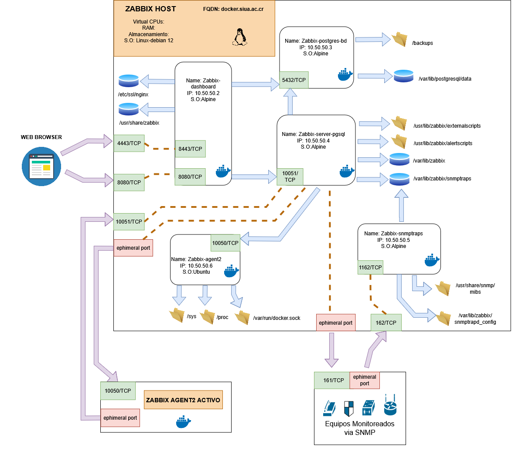

# **Zabbix Monitoring Stack – Docker Compose**


Stack completo y modular para desplegar **Zabbix 7.4** en entornos de producción utilizando **Docker Compose**.
Incluye base de datos optimizada, servidor, interfaz web, SNMP traps y agente2 local.

---

# 📦 **Arquitectura del Stack**

| Componente             | Versión | Descripción                             |
| ---------------------- | ------- | --------------------------------------- |
| **PostgreSQL**         | 17.6    | Base de datos principal de Zabbix       |
| **Zabbix Server**      | 7.4.6   | Motor central de monitoreo              |
| **Zabbix Web**         | 7.4.6   | Interfaz gráfica (Nginx + PHP-FPM)      |
| **Zabbix Agent2**      | 7.4.3   | Agente avanzado para monitoreo del host |


---



---

# 🔌 **Mapa de Puertos**

| Puerto    | Protocolo | Uso                      |
| --------- | --------- | ------------------------ |
| **8080**  | TCP       | Interfaz Web (HTTP)      |
| **4443**  | TCP       | Interfaz Web (HTTPS)     |
| **10051** | TCP       | Server ↔ Agentes activos |
| **162**   | UDP       | Recepción de SNMP traps  |

---

# 💾 **Volúmenes Persistentes**

| Volumen                   | Contenedor    | Uso                          |
| ------------------------- | ------------- | ---------------------------- |
| `zabbix-postgresdb`       | PostgreSQL    | Base de datos Zabbix         |
| `zabbix-server`           | Zabbix Server | Configuración y runtime      |
| `zabbix-snmptraps`        | Zabbix Server | Almacenamiento de traps SNMP |
| `zabbix_dashboard_config` | Zabbix Web    | Configuración del frontend   |
| `zabbix_certificados`     | Zabbix Web    | Certificados SSL/TLS         |

## Todos los volúmenes persisten automáticamente entre reinicios.

# 💾 **Bind Mounts**

| Bind Mounts                        | Contenedor       | Uso                            |
| ---------------------------------- | ---------------- | ------------------------------ |
| `/backups`                         | PostgreSQL       | Backups de la Base de Datos    |
| `/usr/lib/zabbix/externalscripts`  | Zabbix Server    | Script externos                |
| `/usr/lib/zabbix/alertscripts`     | Zabbix Server    | Script para Alertas            |
| `/usr/share/snmp/mibs`             | Zabbix snmptraps | Mibs externas                  |
| `/var/lib/zabbix/snmptrapd_config` | Zabbix snmptraps | Configuración de snmptraps     |
| `/sys`                             | Zabbix Agent2    | Acceso para reporte a Servidor |
| `/proc`                            | Zabbix Agent2    | Acceso para reporte a Servidor |
| `/var/run/docker.sock`             | Zabbix Agent2    | Acceso para reporte a Servidor |

---

# 🚀 **Implementación Rápida**

### **1. Prerrequisitos**

- **Docker Engine 20.10+**
- **Docker Compose 2.0+**
- **Puertos 8080/4443/10051/162 disponibles**

---

## **2. Descargar o Clonar el repositorio**

```bash
wget https://github.com/rsol9000/zabbix-docker/archive/main.zip -O zabbix-stack.zip
cd zabbix-stack
```

```bash
git clone <repository-url>
cd zabbix-stack
```

---

## **3. Configurar variables de entorno**

```bash
cp .env.pub .env
nano .env
```

### **Variables críticas**

```env
POSTGRES_USER=zabbix_admin
POSTGRES_PASSWORD=super_secure_password
```

### **Variables opcionales**

```env
ZBX_SERVER_HOST=zabbix-server
ZBX_SERVER_NAME=Zabbix Monitoring
ZBX_TIMEZONE=America/Costa_Rica
```

---

# ▶️ **Despliegue**

```bash
docker-compose up -d
```

Comprobar estado:

```bash
docker-compose ps
```

Logs del servidor:

```bash
docker-compose logs -f zabbix-server
```

---

# 🌐 **Acceso a la Interfaz Web**

| Protocolo | URL                          |
| --------- | ---------------------------- |
| **HTTP**  | `http://<IP-SERVIDOR>:8080`  |
| **HTTPS** | `https://<IP-SERVIDOR>:4443` |

---

# 🔐 **Habilitar HTTPS**

```bash
cp ssl/cert.pem ssl/key.pem ./certificates/
docker-compose restart zabbix-web
```

Requiere certificados válidos (Let’s Encrypt, ACME u otros).

---

# 🖥️ **Agentes Zabbix**

El stack incluye **Zabbix Agent2 local**.
Para agentes remotos:

```bash
ZabbixServer=<SERVER_IP>
ZabbixServerActive=<SERVER_IP>
```

Ideal para servidores Linux, contenedores o equipos remotos.

---

# 📡 **Monitoreo por SNMP Traps**

El receptor escucha en **UDP 162**.

Ejemplo para routers/switches:

```
snmp-server host <ZABBIX_SERVER_IP> traps version 2c public
```

---

# 🛠️ **Comandos Útiles de Administración**

```bash
# Estado del stack
docker-compose ps

# Logs globales
docker-compose logs -f

# Backup de la base de datos
docker-compose exec postgres pg_dump -U $POSTGRES_USER zabbix > backup.sql

# Reinicio de servicios
docker-compose restart zabbix-server

# Bajar el stack completo
docker-compose down
```

---

# 🔒 **Recomendaciones de Seguridad**

- Cambiar todas las contraseñas por defecto
- Restringir puertos con firewall (ufw, nftables)
- Usar HTTPS en producción
- Implementar políticas de backup automático
- Revisar logs de acceso y traps regularmente
- Mantener las imágenes de Docker actualizadas

---

# 📝 **Notas de Versión**

- **Zabbix 7.4.6** — Versión LTS estable
- **PostgreSQL 17.6** — Óptimo para cargas intensivas
- **Agent2** — Mejor capacidad para contenedores, plugins modernos

---
